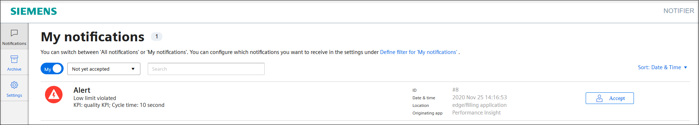
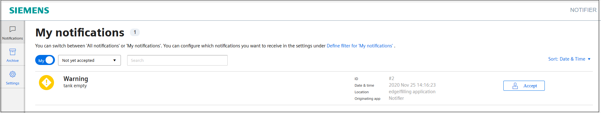
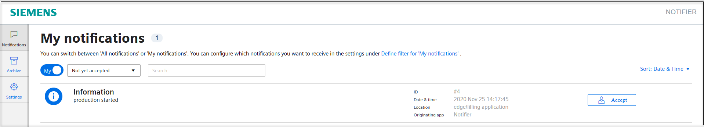

# Notifier application example

This example shows how to use the Industrial Edge App "Notifier" to create notifications in case of an event.

- [Notifier application example](#notifier-application-example)
  - [Description](#description)
    - [Overview](#overview)
    - [General task](#general-task)
  - [Requirements](#requirements)
    - [Prerequisities](#prerequisities)
    - [Used components](#used-components)
    - [TIA Project](#tia-project)
  - [Installation steps](#installation-steps)
  - [Usage](#usage)
  - [Documentation](#documentation)
  - [Contribution](#contribution)
  - [Licence and Legal Information](#licence-and-legal-information)

## Description

### Overview

This document describes how to manage globally available notifications generated in case of an event.
These events can be watched by a mobile phone or a smartwatch.

### General task

A filling process is monitored by the Industrial Edge. In case of certain events notifications are generated by the system using the Notifier.
Data is read from the PLC using the S7 Connector and published to the IE Databus.
Necessary values are collected and managed by the [Data Service](https://github.com/industrial-edge/data-service).
The Notifier as well as Performance Insight (for KPIs) can use these data to create the following notification rules:

- Information: Production was started
- Warning: Tank level falls below a defined level
- Alert: Production quality falls below defined KPI level

## Requirements

### Prerequisities

- Access to an Industrial Edge Management System (IEM)
- Onboarded Industial Edge Device on IEM
- Installed System Configurators for Databus and S7 Connector
- Installed System Apps Databus and S7 Connector
- Installed Apps Data Service, Performance Insight and Notifier
- Edge device is connected to PLC
- TIA portal project loaded on PLC
- Google Chrome (Version ≥ 72) or Firefox (Version ≥ 62)

### Used components

- Industrial Edge Management V1.2.0-36 / V1.2.14
  - IE Databus V1.2.16
  - IE Databus Configurator V1.2.23
  - S7 Connector V1.2.26
  - S7 Connector Configurator V1.2.32
  - Data Service V1.1.1
  - Performance Insight V1.2.1
  - Notifier V1.2.0
- Industrial Edge Device V 1.2.0-56
- TIA Portal V16
- PLC: CPU 1511 FW 2.8.3

### TIA Project

The used TIA Portal project can be found in the miscellaneous repository under "[tank application](https://github.com/industrial-edge/miscellaneous/tree/main/tank%20application)".

## Installation steps

You can find the further information about the following steps in the [docs](docs/Installation.md)

- Configure PLC project
- Configure PLC Connection (Databus, S7 Connector, Data Service)
- Configure Performance Insight
- Configure Notifier

## Usage

To run the application, follow these instructions:

- Make sure that the  PLC is connected to the Edge device and TIA project is downloaded
- S7 Connector, Databus and Data Service applications are running
- Performance Insight and Notifier are running
- Open the Notifier user interface
- Start the filling application via the HMI

Simulate some 'faulty bottle' productions in the HMI
-> alert "Low limit violated" (KPI) appears in the Notifier

Wait till the tank level falls near 160l
-> warning "tank empty" appears in the Notifier

Reset and start the filling simulation in the HMI
-> information "production started" appears in the Notifier

Hint: Notifications can be triggered by other apps, such as Performance Insight.
To identify where the notification originated, the detail text of the respective notification contains the Operating App area.

By accepting a notification, you inform  other users that you will take care of the issue. The acceptance of a notification cannot be undone.
A notification is marked as "automatically resolved" in the Archive tab, when it has not been accepted by any user or the reason for triggering no longer exists.

## Documentation

You can find further documentation and help in the following links
  - [Industrial Edge Hub](https://iehub.eu1.edge.siemens.cloud/#/documentation)
  - [Industrial Edge Forum](https://www.siemens.com/industrial-edge-forum)
  - [Industrial Edge landing page](http://siemens.com/industrial-edge)
  
## Contribution

Thanks for your interest in contributing. Anybody is free to report bugs, unclear documenation, and other problems regarding this repository in the Issues section or, even better, is free to propose any changes to this repository using Merge Requests.

## Licence and Legal Information

Please read the [Legal information](LICENSE.md).
