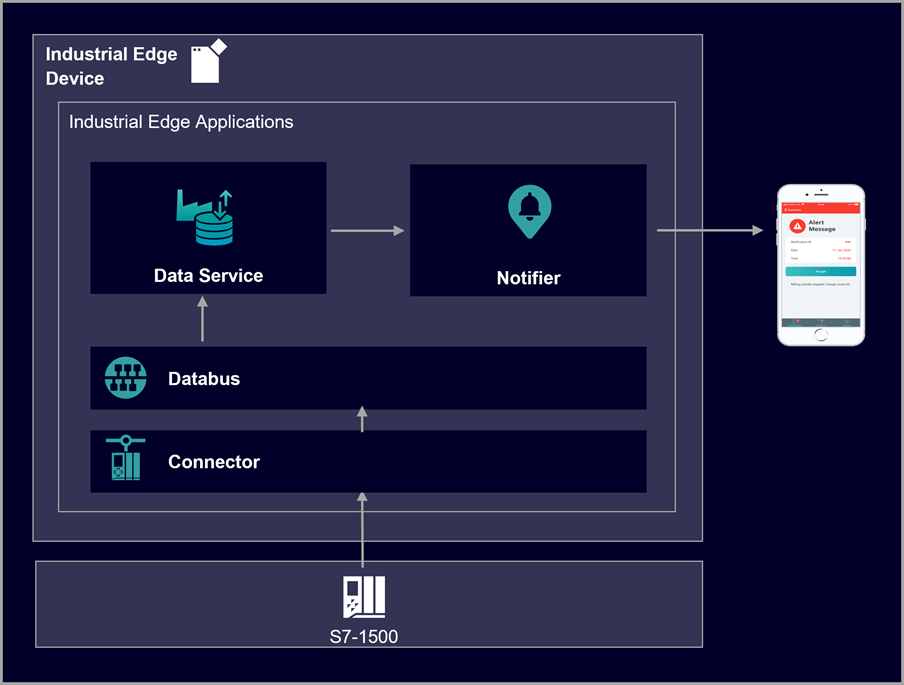

# Notifier

This example shows how to use the Industrial Edge app "Notifier" to create notifications in case of an event.

- [Notifier application example](#notifier-application-example)
  - [Description](#description)
    - [Overview](#overview)
    - [General task](#general-task)
  - [Requirements](#requirements)
    - [Prerequisities](#prerequisities)
    - [Used components](#used-components)
    - [TIA Project](#tia-project)
  - [Configuration steps](#configuration-steps)
  - [Usage](#usage)
    - [Showing notifications](#showing-notifications)
    - [Accepting notifications](#accepting-notifications)
    - [Archived notifications](#archived-notifications)
  - [Documentation](#documentation)
  - [Contribution](#contribution)
  - [Licence and Legal Information](#licence-and-legal-information)

## Description

### Overview

The Notifier, that is running on the Industrial Edge Device (IED), offers globally accessible notifications that are generated in case of an event. For this purpose, the app monitors the variables stored in the Data Service according to the notification rules you have configured. Notifications can be accepted by a user. This means that this user will take care of the trigger event.

There are three types of notifications: 

- **Alert**: Notifications of the highest priority to which a response is expected immediately.
- **Warning**: Notifications of medium priority that inform the user of an important status or problem in the plant, for example, when a parameter limit has been exceeded.
- **Information**: Information about low priority events, such as pending maintenance.

If the Notifier has some connected clients (mobile devices with Notifier mobile app running), it sends push notifications to the clients in case of an event. Thus the staff on site is informed immediately about issues within the facility, which reduces reaction times and downtimes. Furthermore the staff is able to see, who took over which responsibility.

### General task

A filling process is monitored by the Industrial Edge system. This example reads data from a PLC via the OPC UA Connector. The acquired data is published to the Databus, from where the Data Service is able to collect the data. Within the Data Service, the data points of interest are created and stored. The Notifier connects to the Data Service and allows the user to create the following notification rules on basis of these parameters:

- Information: Production was stopped
- Warning: High gas consumption
- Alert: Error within production

In case of these events, notifications are generated and send to a mobile device (iOS) with installed Notifier app.

## Requirements

### Prerequisities

- Access to an Industrial Edge Management System (IEM)
- Onboarded Industial Edge Device on IEM
- Installed System Configurators for Databus and OPC UA Connector
- Installed System Apps Databus and OPC UA Connector
- Installed Apps Data Service and Notifier
- Edge device is connected to PLC
- TIA portal project loaded on PLC
- HTML5-capable Internet browser (in general it is advised to use Chrome, for Linux based systems it is recommended to use Firefox)

### Used components

- Industrial Edge Management OS V1.5.2-4
  - IE Databus Configurator V2.1.0-3
  - Common Connector Configurator V1.8.2-3
- Industrial Edge Management App V1.12.10
  - OPC UA Connector V1.8.1-6
  - IE Databus V2.1.0-4
  - Data Service V1.7.0
  - Notifier V1.15.0
- Industrial Edge Device V1.8.0-6
- SIMATIC Notifier mobile app for iOS V1.0.5

### TIA Project

The used TIA Portal project can be found in the miscellaneous repository under "[tank application](https://github.com/industrial-edge/miscellaneous/tree/main/tank%20application)".

## Configuration steps

You can find the further information about the following steps in the [configuration](docs/Installation.md) documentation:

- [Configure PLC Connection](/docs/Installation.md#configure-plc-connection)
- [Configure Data Service](/docs/Installation.md#configure-data-service)
- [Configure Notifier](/docs/Installation.md#configure-notifier)
- [Connect smart devices](/docs/Installation.md#connect-smart-devices)

## Usage

Once the Notifier is successfully configured and running on the IED and (optional) the Notifier mobile app is installed on a smart device, the staff is able to receive notifications in case of an event. All notifications are displayed on the Notifier start page on the IED. The smart device shows only the notifications that were selected using the 'My notifications' filter within the Notifier settings. On both sides, the users can accept the notifications.

### Showing notifications

On the IED, open the Notifier app UI. On the "Notifications" start page you directly see the the incoming notificiations according to the rules you have created. There are two possible views available:

- All notifications (all notifications are displayed)
- My notifications (notifications according the filter settings for "My notifications" are displayed)

Hint: Notifications can also be triggered by other apps, such as Performance Insight or Machine Monitor. In the detail text of the notification, the origin is displayed in the "Originating app" area.

On the smartphone, a push notification is received in case of a new notification.

If user groups are set up in the app, the users of a group are notified of the events in the specified order. If one user can not accept the notification, it is forwarded to the next one after the configured time.

### Accepting notifications

By accepting a notification, you inform other users that you will take care of the issue.

To accept a notification via the Notifier app UI, click "Accept" in the list of notifications. Here you can also reset the acceptance of a notification.

To accept a notification on the smartphone, click "Accept" in the detail view of a notification.

    

### Archived notifications

The "Archive" view within the Notifier app UI shows the notifications that have been automatically resolved or deleted.

A notification is marked as "automatically resolved", when it has not been accepted by any user or the reason for triggering no longer exists.

## Documentation

You can find further documentation and help in the following links

  - [Industrial Edge Hub](https://iehub.eu1.edge.siemens.cloud/#/documentation)
  - [Industrial Edge Forum](https://www.siemens.com/industrial-edge-forum)
  - [Industrial Edge landing page](https://new.siemens.com/global/en/products/automation/topic-areas/industrial-edge/simatic-edge.html)
  - [Industrial Edge GitHub page](https://github.com/industrial-edge)
  
## Contribution

Thank you for your interest in contributing. Anybody is free to report bugs, unclear documentation, and other problems regarding this repository in the Issues section.
Additionally everybody is free to propose any changes to this repository using Pull Requests.

If you are interested in contributing via Pull Request, please check the [Contribution License Agreement](Siemens_CLA_1.1.pdf) and forward a signed copy to [industrialedge.industry@siemens.com](mailto:industrialedge.industry@siemens.com?subject=CLA%20Agreement%20Industrial-Edge).

## Licence and Legal Information

Please read the [Legal information](LICENSE.md).
