# Configuration

- [Configuration](#configuration)
  - [Configure PLC project](#configure-plc-project)
  - [Configure PLC Connection](#configure-plc-connection)
  - [Configure Performance Insight](#configure-performance-insight)
  - [Configure Notifier](#configure-notifier)
  - [Configure Notifier iOS](#configure-notifier-ios)

## Configure PLC project

1) Open TIA portal and open the project containing the filling application
2) Download the PLC program to the PLC and set the PLC into RUN
3) Open the HMI to control the filling application

## Configure PLC Connection

To read data from the PLC and provide the data, we will use S7 Connector to establish connection with the PLC via OPC UA.
The S7 Connector sends the data to the Databus, where the Data Service app can collect what is needed for the notification rules.
In order to build this infrastructure, these apps must be configured properly:

- IE Databus
- S7 Connector
- Data Service

Please refer to [using the Data Service](https://github.com/industrial-edge/data-service).

Finally the configurations should look like this:

**IE Databus**

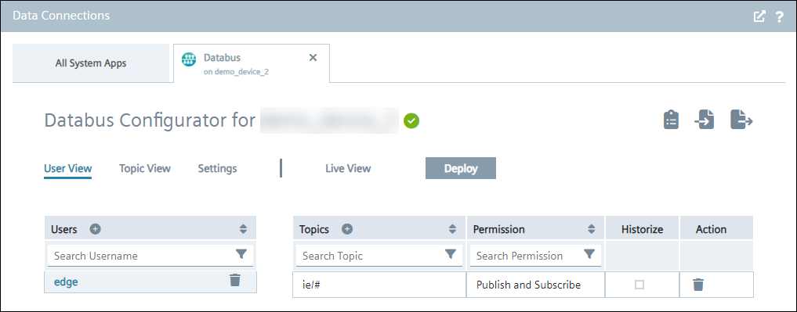

**S7 Connector**

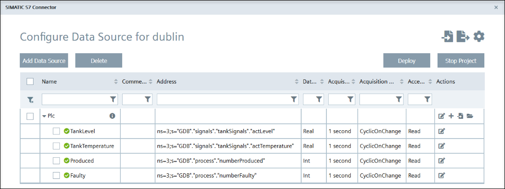

**Data Service**

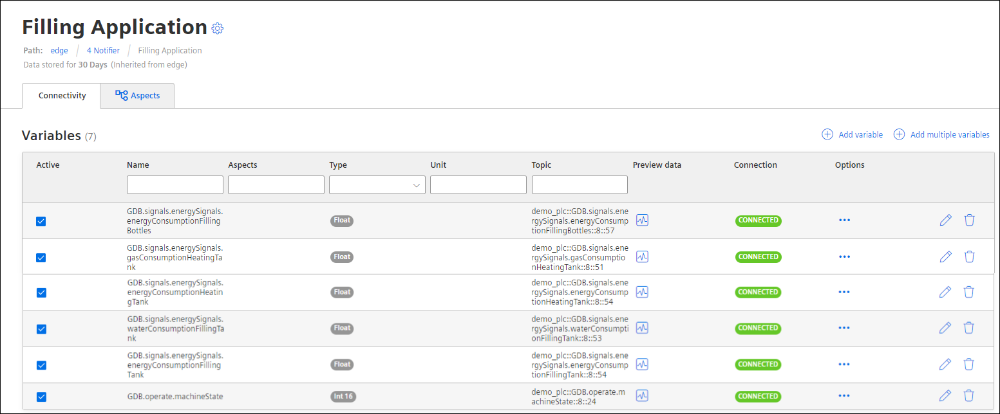

## Configure Performance Insight

In order to create a KPI and assign appropriate variables, we need to use the Performance Insight app.
Limit values and activate notifications can be configured here, which will be forwarded to the Notifier.

Open the user interface of the Performance Insight app on your IE Device. On the left bar navigate to Configuration > KPI types and click "New KPI type".
Create a new KPI "production quality" with the following formula (`<faulty>` and `<produced>` are operands)

`100 - (<faulty> / <produced> * 100%)`

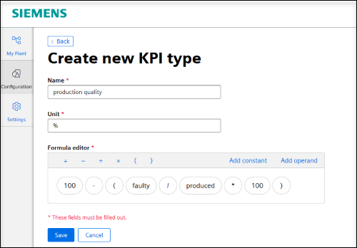

Navigate to My Plant > filling application > Parameter (drop down menu on the top of the heading).

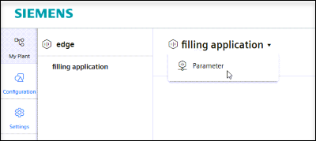

Choose 'New KPI instance' to create a new instance according to the following settings:

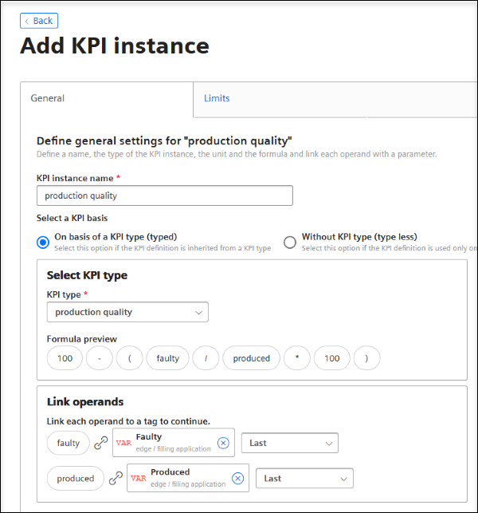

Select the tab 'Limits' to enter the low limit for the KPI value and activate the notification option:

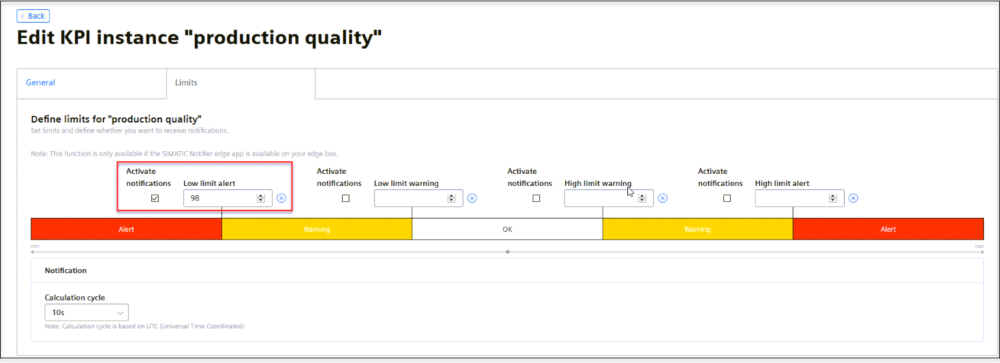

Now a new KPI instance should be available:

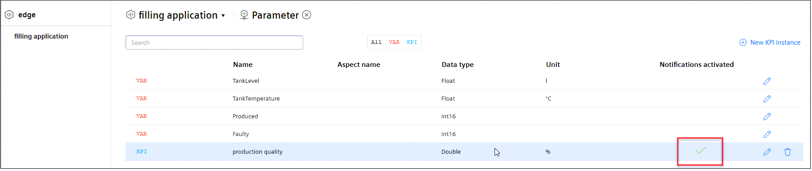

## Configure Notifier

In the chapter above we already created an alert notification for the KPI "production quality".
In order to create some warning and information notifications, we now use the Notifier app.

Open the user interface of the Notifier app on your IE Device. On the left bar navigate to Settings > Manage notification rules and click "Add notification rule".
Create a new warning notification "tank empty" with the following settings:

Create a further information notification "production started" with the following settings:

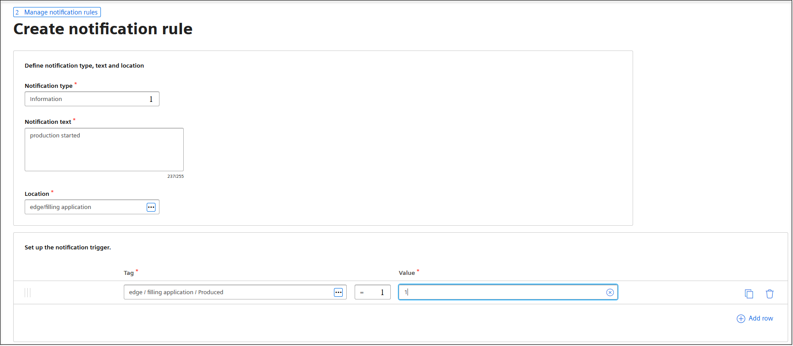

## Configure Notifier iOS

Open the Notifier iOS app and tap "Add connection" to select a connection.

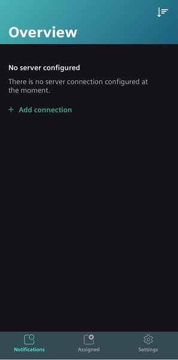

Select "Edge" as the connection.

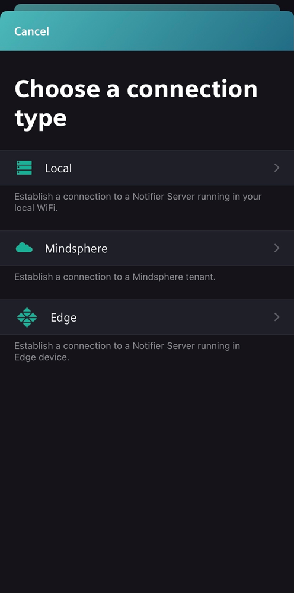

Enter the login data from your Edge and tap "Login" to confirm the data.

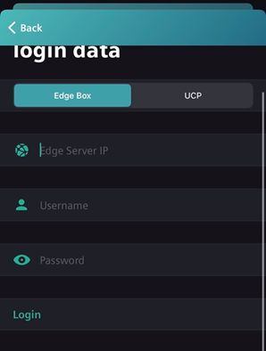

Activate the heartbeat to get a sound if there is a connection to the server.

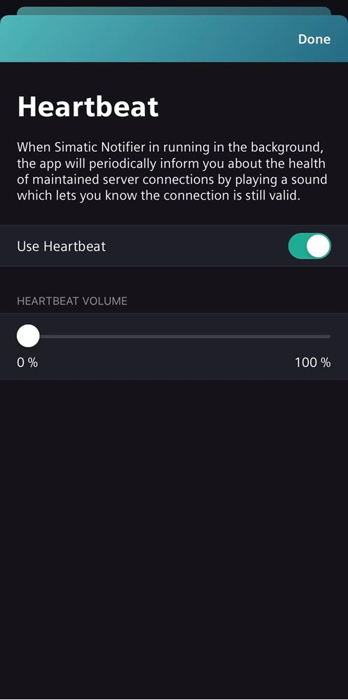

Under "Notifications" you can see the warning and information you have created in the Edge Notifier App.

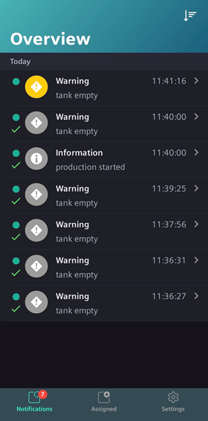
